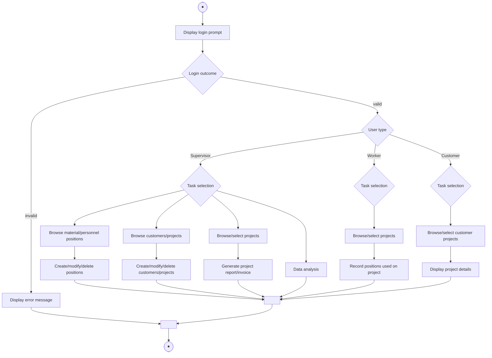

# Activity Diagram

```mermaid
flowchart TD
    START([●]) --> DISPLAY_LOGIN[Display login prompt]
    DISPLAY_LOGIN --> LOGIN_OUTCOME{Login outcome}
    LOGIN_OUTCOME -- invalid --> ERROR[Display error message] --> MERGE_TOP[ ]
    LOGIN_OUTCOME -- valid --> USER_TYPE{User type}

    USER_TYPE -- Supervisor --> TASK_SUP{Task selection}
    TASK_SUP --> SUP1[Browse material/personnel positions]
    TASK_SUP --> SUP2[Browse customers/projects]
    TASK_SUP --> SUP3[Browse/select projects]
    TASK_SUP --> SUP4[Data analysis]

    SUP1 --> SUP1B[Create/modify/delete positions]
    SUP2 --> SUP2B[Create/modify/delete customers/projects]
    SUP3 --> SUP3B[Generate project report/invoice]

    SUP1B --> MERGE_MID[ ]
    SUP2B --> MERGE_MID
    SUP3B --> MERGE_MID
    SUP4 --> MERGE_MID

    USER_TYPE -- Worker --> TASK_WRK{Task selection}
    TASK_WRK --> WRK1[Browse/select projects]
    WRK1 --> WRK1B[Record positions used on project]
    WRK1B --> MERGE_MID

    USER_TYPE -- Customer --> TASK_CUS{Task selection}
    TASK_CUS --> CUS1[Browse/select customer projects]
    CUS1 --> CUS1B[Display project details]
    CUS1B --> MERGE_MID

    MERGE_MID --> MERGE_TOP
    MERGE_TOP --> END([●])
```
