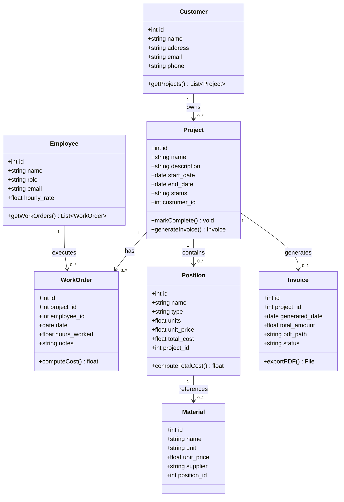

# Class Diagram

```mermaid
classDiagram
    class Customer {
        +int id
        +string name
        +string address
        +string email
        +string phone
        +getProjects() List~Project~
    }

    class Employee {
        +int id
        +string name
        +string role
        +string email
        +float hourly_rate
        +getWorkOrders() List~WorkOrder~
    }

    class Project {
        +int id
        +string name
        +string description
        +date start_date
        +date end_date
        +string status
        +int customer_id
        +markComplete() void
        +generateInvoice() Invoice
    }

    class WorkOrder {
        +int id
        +int project_id
        +int employee_id
        +date date
        +float hours_worked
        +string notes
        +computeCost() float
    }

    class Position {
        +int id
        +string name
        +string type
        +float units
        +float unit_price
        +float total_cost
        +int project_id
        +computeTotalCost() float
    }

    class Material {
        +int id
        +string name
        +string unit
        +float unit_price
        +string supplier
        +int position_id
    }

    class Invoice {
        +int id
        +int project_id
        +date generated_date
        +float total_amount
        +string pdf_path
        +string status
        +exportPDF() File
    }

    Customer "1" --> "0..*" Project : owns
    Project "1" --> "0..*" WorkOrder : has
    Employee "1" --> "0..*" WorkOrder : executes
    Project "1" --> "0..*" Position : contains
    Position "1" --> "0..1" Material : references
    Project "1" --> "0..1" Invoice : generates
```
