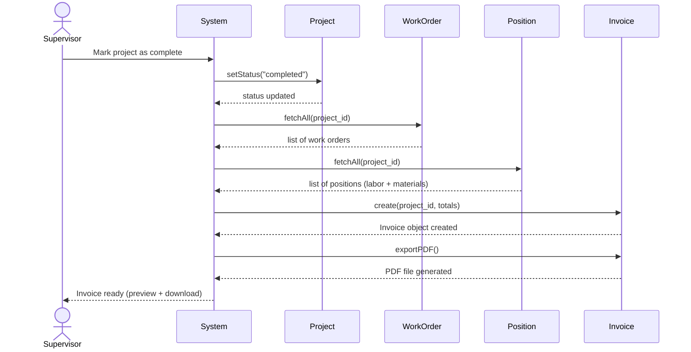

# Sequence Diagram

```mermaid
sequenceDiagram
    actor Supervisor
    participant System
    participant Project
    participant WorkOrder
    participant Position
    participant Invoice

    Supervisor->>System: Mark project as complete
    System->>Project: setStatus("completed")
    Project-->>System: status updated

    System->>WorkOrder: fetchAll(project_id)
    WorkOrder-->>System: list of work orders

    System->>Position: fetchAll(project_id)
    Position-->>System: list of positions (labor + materials)

    System->>Invoice: create(project_id, totals)
    Invoice-->>System: Invoice object created

    System->>Invoice: exportPDF()
    Invoice-->>System: PDF file generated

    System-->>Supervisor: Invoice ready (preview + download)
```
