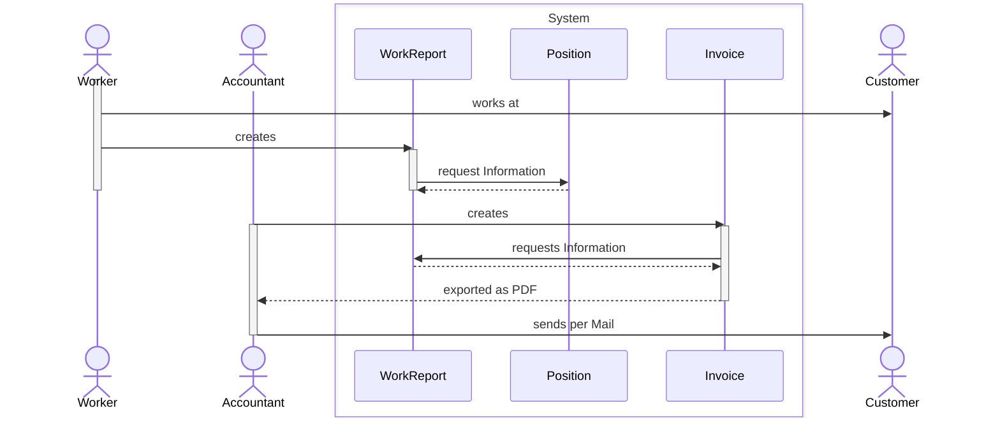

# Sequence Diagram

```mermaid
sequenceDiagram
    actor Worker
    actor Accountant
    box System
    participant WorkReport
    participant Position
    participant Invoice
    end
    actor Customer

    activate Worker
    Worker->>Customer: works at
    Worker->>WorkReport: creates
    activate WorkReport
    WorkReport->>Position: request Information
    Position-->>WorkReport:
    deactivate WorkReport
    deactivate Worker
    Accountant->>Invoice: creates
    activate Accountant
    activate Invoice
    Invoice->>WorkReport: requests Information
    WorkReport-->>Invoice:
    Invoice-->>Accountant: exported as PDF
    deactivate Invoice
    Accountant->>Customer: sends per Mail
    deactivate Accountant


```
