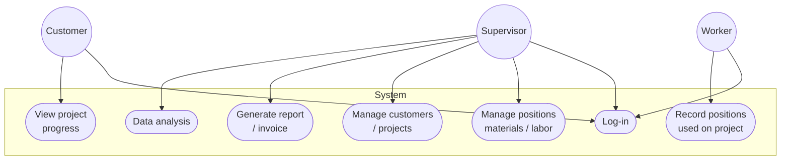

# Use-case Diagram

```mermaid
flowchart TD
    subgraph System
        LOGIN([Log-in])
        MP([Manage positions\nmaterials / labor])
        MCP([Manage customers\n/ projects])
        GRI([Generate report\n/ invoice])
        DA([Data analysis])
        VPP([View project\nprogress])
        RPU([Record positions\nused on project])
    end

    SUPERVISOR((Supervisor))
    WORKER((Worker))
    CUSTOMER((Customer))

    SUPERVISOR --> LOGIN
    SUPERVISOR --> MP
    SUPERVISOR --> MCP
    SUPERVISOR --> GRI
    SUPERVISOR --> DA

    WORKER --> LOGIN
    WORKER --> RPU

    CUSTOMER --> LOGIN
    CUSTOMER --> VPP
```
