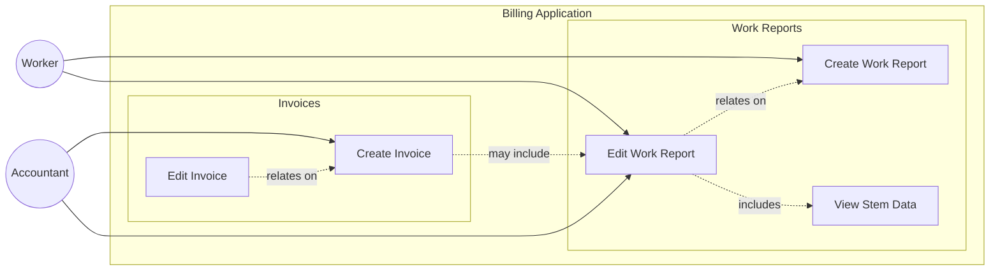

# Use-case Diagram

```mermaid
flowchart LR
    subgraph Billing Application
        subgraph Work Reports
            CWR[Create Work Report]
            EWR[Edit Work Report]
            VSD[View Stem Data]
        end
        subgraph Invoices
            CI[Create Invoice]
            EI[Edit Invoice]
        end
    end

    WO((Worker))
    AC((Accountant))

    WO ----> CWR
    WO ----> EWR
    AC ---> CI
    CI -. may include .-> EWR
    EI -. relates on .-> CI
    EWR -. includes .-> VSD
    EWR -. relates on .-> CWR


    AC --> EWR
```
