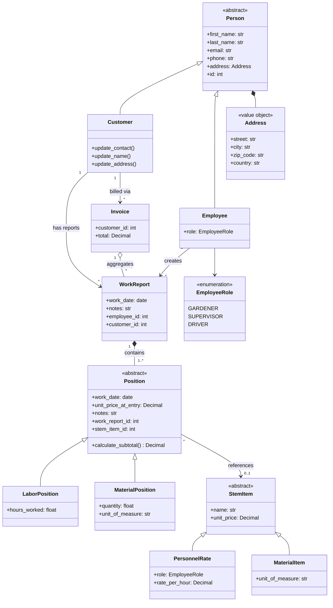

# Domain Class Diagram
 

```mermaid
classDiagram
    class Person {
        <<abstract>>
        +first_name: str
        +last_name: str
        +email: str
        +phone: str
        +address: Address
        +id: int
    }
 
    class Customer {
        +update_contact()
        +update_name()
        +update_address()
    }
 
    class Employee {
        +role: EmployeeRole
    }
 
    class WorkReport {
        +work_date: date
        +notes: str
        +employee_id: int
        +customer_id: int
    }
 
    class Invoice {
        +customer_id: int
        +total: Decimal
    }
 
    class Position {
        <<abstract>>
        +work_date: date
        +unit_price_at_entry: Decimal
        +notes: str
        +work_report_id: int
        +stem_item_id: int
        +calculate_subtotal() Decimal
    }
 
    class LaborPosition {
        +hours_worked: float
    }
 
    class MaterialPosition {
        +quantity: float
        +unit_of_measure: str
    }
 
    class StemItem {
        <<abstract>>
        +name: str
        +unit_price: Decimal
    }
 
    class PersonnelRate {
        +role: EmployeeRole
        +rate_per_hour: Decimal
    }
 
    class MaterialItem {
        +unit_of_measure: str
    }
 
    class Address {
        <<value object>>
        +street: str
        +city: str
        +zip_code: str
        +country: str
    }
 
    class EmployeeRole {
        <<enumeration>>
        GARDENER
        SUPERVISOR
        DRIVER
    }
 
    Person <|-- Customer
    Person <|-- Employee
    Person *-- Address
 
    Customer "1" --> "*" WorkReport : has reports
    Customer "1" --> "*" Invoice : billed via
    Employee "1" --> "*" WorkReport : creates
 
    Invoice "1" o-- "*" WorkReport : aggregates
    WorkReport "1" *-- "1..*" Position : contains
 
    Position <|-- LaborPosition
    Position <|-- MaterialPosition
    Position "*" --> "0..1" StemItem : references
 
    StemItem <|-- PersonnelRate
    StemItem <|-- MaterialItem
 
    Employee --> EmployeeRole
```